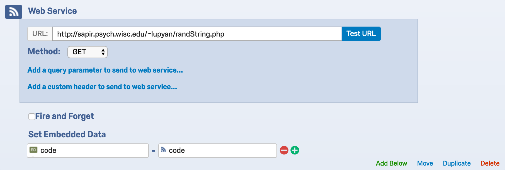
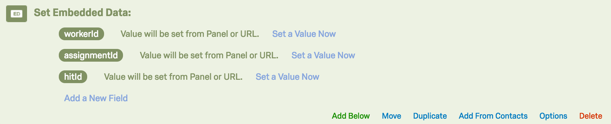

```{r config, include=FALSE}
knitr::opts_chunk$set(echo=FALSE, fig.path="figs/")
```

# So you want to collect some data with MTurk workers?

1. Create a Qualtrics survey. [survey.wisc.edu](https://survey.wisc.edu)
2. Get a URL to the survey by making the survey live.
3. Create a MTurk HIT. [requester.mturk.com](https://requester.mturk.com)
4. Give people who accept the HIT the URL to the survey.
5. Decide how to verify whether the worker did what they were supposed to: **completion codes** and **attention checks**.

# Worker flow

```{r worker-flow, engine="dot", fig.width=3}
digraph {
  node[shape=none fontname=Helvetica];
  edge[arrowhead="vee" fontname=Helvetica]
  rankdir = LR;
  worker[label="Worker"];
  worker -> mturk[constraint=false];
  mturk -> qualtrics[minlen=2 label="URL"];
  mturk[label="MTurk"];
  qualtrics[label="Qualtrics"];

  { rank=same; qualtrics, data};
  qualtrics -> data[constraint=false];
  data[label="Data"];

  qualtrics -> completion_code[constraint=false];
  completion_code -> mturk[constraint=false];
  completion_code[label="Completion Code"];
}
```

# Giving people a completion code

- Go to Survey Flow.
- Add an End of Survey message to the flow.
- Set an End of Survey message with the completion code in it.

# Generating unique completion codes

> Don't get scammed!

The more complex the completion codes, the more difficult it is to verify.  
Solution: Generate unique completion codes with some common elements.

```
# sapir.psych.wisc.edu/~lupyan/randString.php
ciDlrCArTrusQUoOlMIs
iOaQJfCrTrMuoPxqJeXM
rgtosZFrTrLDgLQENvBU
fJYYDeTrTrvRekLuhNCL
```

# Getting randomly generated codes in End of Survey messages

- Go to Survey Flow.
- Add a Web Service to the Survey Flow.
- Capture the result of the random string script in an Embedded Data variable.



# So far

1. How to generate completion codes so you know who completed the survey.
2. _Next: How to verify participation from their responses to the survey._

# Experimenter flow

```{r experimenter-flow, engine="dot", fig.width=3}
digraph {
  node[shape=none fontname=Helvetica];
  edge[arrowhead="vee" fontname=Helvetica]
  rankdir = LR;
  mturk -> qualtrics[minlen=2 label="URL"];
  mturk[label="MTurk"];
  qualtrics[label="Qualtrics"];

  { rank=same; qualtrics, data};
  qualtrics -> data[constraint=false];
  data[label="Data"];

  mturk -> view_codes[constraint=false];
  view_codes[label="View Codes"];
  view_codes -> approve_payment[headport=n];
  data -> approve_payment[constraint=false headport=ne];
  approve_payment[label="Approve Payment"];
}
```

# Attention checks

- Questions to test if the worker is paying attention or clicking blindly.
- Usually best if it somehow resembles the other questions in the survey.
- If you will *not* pay people for failing an attention check, you should warng
  about it in the HIT description.
- Another strategy is to pay everyone who does the survey, but exclude data
  for analysis based on whether they failed the attention check.

# Problem: Linking data and completion codes

```{r linking-data, engine="dot", fig.width=3}
digraph {
  node[shape=none fontname=Helvetica];
  edge[arrowhead="vee" fontname=Helvetica]
  rankdir = LR;
  mturk -> qualtrics[minlen=2 label="URL + workerId"];
  mturk[label="MTurk"];
  qualtrics[label="Qualtrics"];

  { rank=same; qualtrics, data};
  qualtrics -> data[constraint=false];
  data[label="Data + workerId"];

  mturk -> view_codes[constraint=false];
  view_codes[label="View Codes + workerId"];

  view_codes -> approve_payment[headport=n];
  data -> approve_payment[constraint=false headport=ne];
  approve_payment[label="Approve Payment\nVerify Data"];
}
```

# Steps to adding workerId to the Qualtrics URL

- **Go to requester.mturk.edu**, find or create the HIT, and insert JavaScript code that fetches the current worker's ID and appends it to the Qualtrics survey URL.
- **Go to Qualtrics via survey.wisc.edu**, and configure the Qualtrics survey to fetch the workerId from the URL and add it to the data.



# JavaScript to put in HIT

```javascript
var qualtricsUrl = "YOUR_FULL_QUALTRICS_URL_HERE";

// Custom function for getting vars from MTurk URL
var urlVars = getUrlVars();

// Append worker vars to the Qualtrics URL
qualtricsUrl = qualtricsUrl +
  "?workerId=" + urlVars["workerId"] +
  "&assignmentId=" + urlVars["assignmentId"] +
  "&hitId=" + urlVars["hitId"];

// Create the link on the page
document.write("<a href=" + qualtricsUrl + ">" +
               "Click here to take the survey." +
               "</a>");
```

# Lab strategy for reuse

Share a "default-lab-hit-description.html" file that can be copied and pasted into a MTurk HIT.

# So far

1. How to generate completion codes so you know who completed the survey.
2. How to verify participation from their responses to the survey.
3. _Next: Preventing participants who completed one HIT from completing another HIT._

# TurkGate

```{r turk-gate, engine="dot", fig.width=3}
digraph {
  node[shape=none fontname=Helvetica];
  edge[arrowhead="vee" fontname=Helvetica]
  rankdir = LR;
  worker;
  worker -> mturk[constraint=false];
  mturk -> turk_gate -> qualtrics;
  
  worker[label="Worker"];

  turk_gate[label="Turk Gate"];
  {rank = same; turk_gate, lab_db};
  turk_gate -> lab_db[constraint=false];

  lab_db[label="Lab Database"];

  mturk[label="MTurk"];
  qualtrics[label="Qualtrics"];

  { rank=same; qualtrics, data};
  qualtrics -> data[constraint=false];
  data[label="Data"];

  turk_gate -> completion_code[constraint=false];
  completion_code -> mturk[constraint=false];
  completion_code[label="Completion Code"];
}
```

# TurkGate

[sapir.psych.wisc.edu/TurkGate/](https://sapir.psych.wisc.edu/TurkGate/)

- Survey URL
- Group Name
