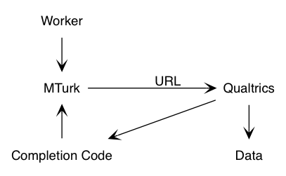
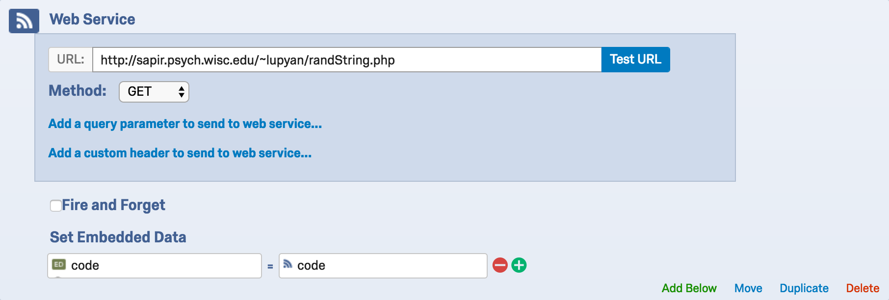
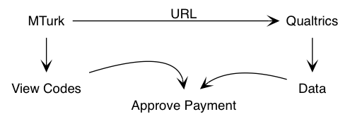
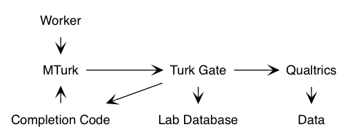

So you want to collect some data with MTurk workers?
====================================================

1.  Create a Qualtrics survey. [survey.wisc.edu](https://survey.wisc.edu)
2.  Get a URL to the survey by making the survey live.
3.  Create a MTurk HIT. [requester.mturk.com](https://requester.mturk.com)
4.  Give people who accept the HIT the URL to the survey.
5.  Decide how to verify whether the worker did what they were supposed to: **completion codes** and **attention checks**.

Worker flow
===========



Giving people a completion code
===============================

-   Go to Survey Flow.
-   Add an End of Survey message to the flow.
-   Set an End of Survey message with the completion code in it.

Generating unique completion codes
==================================

> Don't get scammed!

The more complex the completion codes, the more difficult it is to verify.
Solution: Generate unique completion codes with some common elements.

    # sapir.psych.wisc.edu/~lupyan/randString.php
    ciDlrCArTrusQUoOlMIs
    iOaQJfCrTrMuoPxqJeXM
    rgtosZFrTrLDgLQENvBU
    fJYYDeTrTrvRekLuhNCL

Getting randomly generated codes in End of Survey messages
==========================================================

-   Go to Survey Flow.
-   Add a Web Service to the Survey Flow.
-   Capture the result of the random string script in an Embedded Data variable.



So far
======

1.  How to generate completion codes so you know who completed the survey.
2.  *Next: How to verify participation from their responses to the survey.*

Experimenter flow
=================



Attention checks
================

-   Questions to test if the worker is paying attention or clicking blindly.
-   Usually best if it somehow resembles the other questions in the survey.
-   If you will *not* pay people for failing an attention check, you should warng about it in the HIT description.
-   Another strategy is to pay everyone who does the survey, but exclude data for analysis based on whether they failed the attention check.

Problem: Linking data and completion codes
==========================================


Steps to adding workerId to the Qualtrics URL
=============================================

-   **Go to requester.mturk.edu**, find or create the HIT, and insert JavaScript code that fetches the current worker's ID and appends it to the Qualtrics survey URL.
-   **Go to Qualtrics via survey.wisc.edu**, and configure the Qualtrics survey to fetch the workerId from the URL and add it to the data.


JavaScript to put in HIT
========================

``` javascript
var qualtricsUrl = "YOUR_FULL_QUALTRICS_URL_HERE";

// Custom function for getting vars from MTurk URL
var urlVars = getUrlVars();

// Append worker vars to the Qualtrics URL
qualtricsUrl = qualtricsUrl +
  "?workerId=" + urlVars["workerId"] +
  "&assignmentId=" + urlVars["assignmentId"] +
  "&hitId=" + urlVars["hitId"];

// Create the link on the page
document.write("<a href=" + qualtricsUrl + ">" +
               "Click here to take the survey." +
               "</a>");
```

Lab strategy for reuse
======================

Share a "default-lab-hit-description.html" file that can be copied and pasted into a MTurk HIT.

So far
======

1.  How to generate completion codes so you know who completed the survey.
2.  How to verify participation from their responses to the survey.
3.  *Next: Preventing participants who completed one HIT from completing another HIT.*

TurkGate
========



TurkGate
========

[sapir.psych.wisc.edu/TurkGate/](https://sapir.psych.wisc.edu/TurkGate/)

-   Survey URL
-   Group Name
